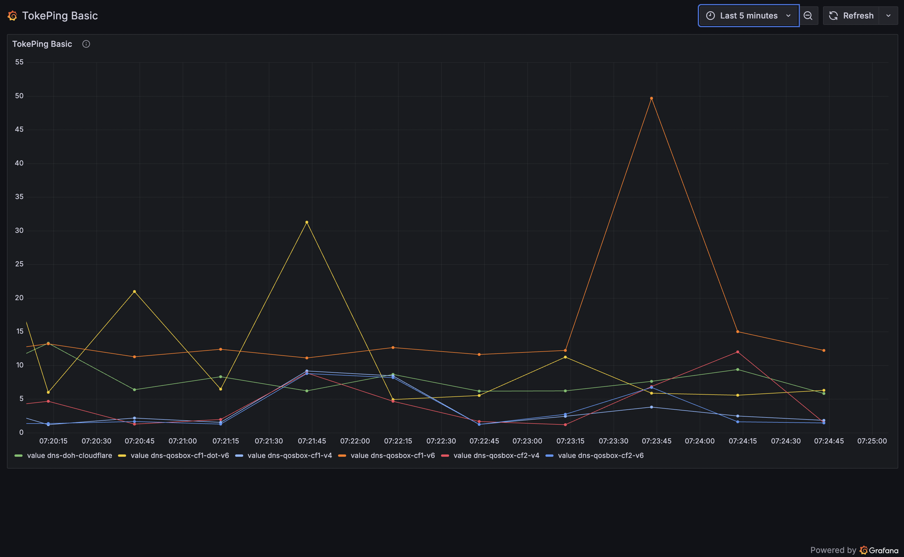

# Tokeping

 An amateurish re-imagining of both [smokeping](https://oss.oetiker.ch/smokeping/) and the successor [vaping](https://github.com/20c/vaping) in golang. Initial version supports primarily ping and DNS and has a nearly identical structure to Vaping (why re-invent the wheel?). The architecture is, like its predecessors, plugin based and modular, with the potential therefor of being a compiled and theoretically faster, lower overhead implementation. Your guess is as good as mine if that is actually the case. 

 A simple grafana dashboard running on the development site is available [here](https://tokeping-dev.mpls.rsvp/public-dashboards/a108473f56ec492fb5b337b8f0416c6b) (Please allow for periodic development work and interruptions due to that).

 


### Features

* Low overhead with few dependencies to run
* Simple web interface that is really only useful for testing configurations.
* File logging of results
* Support for InfluxDB
* Support for ZeroMQ
* Expandable with go based plugins.

### Scalabiliy

It *should* scale. This still needs more testing. If you find a limit or a bug, let me know. 

### Installation (assumes Linux, should work on other systems that can run go; untested)

Download the tokeping binary or build from source:

```
git clone https://github.com/you/tokeping.git
cd tokeping
go build -o tokeping ./cmd/tokeping
```

Configure config.yaml in the project root.

Install dependencies (if using ZeroMQ):

```
sudo apt-get update
sudo apt-get install pkg-config libzmq3-dev
```

Copy dist-config.yaml to config.yaml making note of any changes for probes, API keys, etc. 

### Use

Start the daemon:

```
./tokeping start -c config.yaml
```

Stop it with Ctrl+C or via your service manager.

### Linux Service file

There is an included linux service (tokeping.service) file to make running this more automatic. Move it into `/etc/systemd/system/` and run the following: 

`sudo systemctl daemon-reload`
`sudo systemctl enable tokeping.service`

Check if it's working with all of the normal methods:

`sudo systemctl status tokeping.service`
`sudo systemctl restart tokeping.service`

etc...

### Simple Web interface

Tokeping serves a built-in web UI over WebSocket and HTTP:

Open your browser to http://localhost:8080/.

View real-time latency charts powered by Chart.js.
This is not really meant for full-time use, and stores no long-term data. It's more just for testing and saying "yeah, it works". 

### Using Grafana

#### Install InfluxDB

Download and install InfluxDB 2.x (Debian/Ubuntu example):

```
wget -qO- https://repos.influxdata.com/influxdb.key | sudo apt-key add -
echo "deb https://repos.influxdata.com/ubuntu $(lsb_release -cs) stable" \
  | sudo tee /etc/apt/sources.list.d/influxdb.list
sudo apt update
sudo apt install influxdb2
sudo systemctl enable influxdb
sudo systemctl start influxdb
```

Run the setup wizard to create an admin user, Org, bucket, and initial token:

```
influx setup --host http://localhost:8086 \
  --username admin --password YourPassword \
  --org tokeping-org --bucket metrics \
  --retention 0 --token YourAdminToken --force
```

#### Install Grafana

Add Grafana repository and install:

```
sudo apt-get install -y apt-transport-https software-properties-common wget
wget -q -O - https://packages.grafana.com/gpg.key | sudo apt-key add -
echo "deb https://packages.grafana.com/oss/deb stable main" \
  | sudo tee /etc/apt/sources.list.d/grafana.list
sudo apt update
sudo apt install grafana
sudo systemctl enable grafana-server
sudo systemctl start grafana-server
```

Open your browser to http://localhost:3000, log in as admin/admin, and reset the password.

#### Configure the InfluxDB data source in Grafana

In Grafana, go to Configuration (⚙️) → Data Sources → Add data source.

Select InfluxDB (Flux).

Under HTTP:

URL: http://localhost:8086

Access: Server (default)

Under InfluxDB Details:

Organization: tokeping-org

Bucket: metrics

Token: your read-only token (create one via the InfluxDB UI under Load Data → Tokens → Generate → Read Token, scoped to Read Buckets and Read Orgs)

Click Save & test (it should report Data source is working).

Create a sample Grafana dashboard

In Grafana click Create (+) → Dashboard → Add new panel.

In the query editor (Flux), paste:

```
from(bucket: "metrics")
  |> range(start: -1h)
  |> filter(fn: (r) => r._measurement == "latency" and r._field == "value")
  |> aggregateWindow(every: $__interval, fn: mean, createEmpty: false)
  |> yield(name: "mean")
```

On the Visualization tab select Time series.

Under Legend set Display name to {{probe}}.

For the Y-axis, set the Unit to ms.

Click Apply, then Save dashboard (e.g. Tokeping Latency).

#### Securing grafana

Don't leave grafana exposed to the world. Wrap it in something like nginx, get a letsencrypt certificate, and reverse proxy it. Instructions for doing so can be found [here](https://grafana.com/tutorials/run-grafana-behind-a-proxy/). 

### Using ZeroMQ

Tokeping can publish JSON metrics over ZeroMQ PUB socket:

Ensure ZeroMQ support is installed (see Installation).

In config.yaml, add:

```
outputs:
  - name: zmq
    type: zmq
    listen: "tcp://127.0.0.1:5556"
```

Subscribe with a ZMQ SUB client:

```
import zmq
ctx = zmq.Context()
sock = ctx.socket(zmq.SUB)
sock.connect("tcp://127.0.0.1:5556")
sock.setsockopt_string(zmq.SUBSCRIBE, "")
while True:
    msg = sock.recv_json()
    print(msg)
```
### Plugins

Tokeping tries to be flexible and to use a plugin architecture similar to Vaping and Smokeping. I will add some more details here "soon". 
