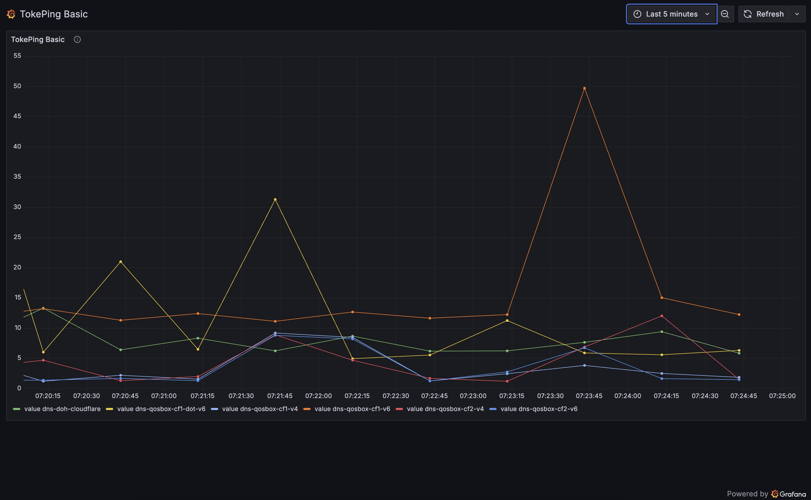

# Tokeping

An amateurish re-imagining of both [smokeping](https://oss.oetiker.ch/smokeping/) and the successor [vaping](https://github.com/20c/vaping) in golang. The architecture is plugin based and modular, with the potential of being a compiled and theoretically faster, lower overhead implementation. 

 A simple grafana dashboard displaying both ping and DNS statistics running on the development site is available [here](https://tokeping-dev.mpls.rsvp/public-dashboards/a108473f56ec492fb5b337b8f0416c6b), and one displaying MTR statistics is available [here](https://tokeping-dev.mpls.rsvp/public-dashboards/a86956c210244d97ab30471aeff13343). Please allow for periodic development work and interruptions.




### Features

* IPv6 first software. All functions default to IPv6, with legacy IP support
* Low overhead with few dependencies to run
* Simple web interface that is useful for testing configurations
* File logging of results
* Support for InfluxDB
* Support for ZeroMQ
* Expandable with go based plugins
* Basic MTR functionality (requires MTR installed on the system)
* IPv4/IPv6 comparison testing via [prototester](https://github.com/buraglio/prototester) integration

### Scalability

It should scale. This still needs more testing. If you find a limit or a bug, let me know.

### Installation (assumes Linux, should work on other systems that can run go; untested)

Download the tokeping binary or build from source:

```
git clone https://github.com/you/tokeping.git
cd tokeping
go build -o tokeping ./cmd/tokeping
```

Configure config.yaml in the project root.

Install dependencies (if using ZeroMQ, MTR, or ProtoTester):

```
sudo apt-get update
sudo apt-get install pkg-config libzmq3-dev mtr

# Optional: Install prototester for IPv4/IPv6 comparison testing
# See https://github.com/buraglio/prototester for installation
```

Copy dist-config.yaml to config.yaml making note of any changes for probes, API keys, etc.

### Configuration Options

Tokeping supports various configuration options in the config.yaml file:

```yaml
# Optional: Buffer size for metric channel (default: 100)
metric_buffer: 100

# Optional: PID file location
pid_file: "/var/run/tokeping.pid"

probes:
  - name: example-probe
    type: ping
    target: 1.1.1.1
    interval: 30s
    timeout: 5s      # Optional: probe-specific timeout (default varies by probe type)
    count: 5         # Optional: for MTR probes, number of cycles (default: 5)

outputs:
  - name: example-output
    type: influxdb
    url: "http://localhost:8086"
    token: "your-token"
    org: "your-org"
    bucket: "metrics"
```

All timeout and count parameters are optional and will use sensible defaults if not specified.

### Use

Start the daemon:

```
./tokeping start -c config.yaml
```

Stop it with Ctrl+C or via your service manager.

Reload the configuration gracefully without dropping PID by sending a `SIGHUP` signal:

```
kill -HUP $(pidof tokeping)
```

### Linux Service file

There is an included linux service (tokeping.service) file to make running this more automatic. Move it into `/etc/systemd/system/` and run the following: 

`sudo systemctl daemon-reload`
`sudo systemctl enable tokeping.service`

Check if it's working with all of the normal methods:

`sudo systemctl status tokeping.service`
`sudo systemctl restart tokeping.service`
`sudo systemctl reload tokeping.service` # Reloads config.yaml gracefully

etc...

### Simple Web interface

Tokeping serves a built-in web UI over WebSocket and HTTP:

Open your browser to http://localhost:8080/.

View real-time latency charts powered by Chart.js.
This interface natively groups responses per-probe using generated color-coded lines and retains the last 60 minutes of metrics in-browser. It is not meant for massive long-term data queries, but acts as quick local visualization to verify things are functioning correctly. 

### Using Grafana

#### Install InfluxDB

Download and install InfluxDB 2.x (Debian/Ubuntu example):

```
wget -qO- https://repos.influxdata.com/influxdb.key | sudo apt-key add -
echo "deb https://repos.influxdata.com/ubuntu $(lsb_release -cs) stable" \
  | sudo tee /etc/apt/sources.list.d/influxdb.list
sudo apt update
sudo apt install influxdb2
sudo systemctl enable influxdb
sudo systemctl start influxdb
```

Run the setup wizard to create an admin user, Org, bucket, and initial token:

```
influx setup --host http://localhost:8086 \
  --username admin --password YourPassword \
  --org tokeping-org --bucket metrics \
  --retention 0 --token YourAdminToken --force
```

#### Install Grafana

Add Grafana repository and install:

```
sudo apt-get install -y apt-transport-https software-properties-common wget
wget -q -O - https://packages.grafana.com/gpg.key | sudo apt-key add -
echo "deb https://packages.grafana.com/oss/deb stable main" \
  | sudo tee /etc/apt/sources.list.d/grafana.list
sudo apt update
sudo apt install grafana
sudo systemctl enable grafana-server
sudo systemctl start grafana-server
```

Open your browser to http://localhost:3000, log in as admin/admin, and reset the password.

#### Configure the InfluxDB data source in Grafana

In Grafana, go to Configuration → Data Sources → Add data source.

Select InfluxDB (Flux).

Under HTTP:

URL: http://localhost:8086

Access: Server (default)

Under InfluxDB Details:

Organization: tokeping-org

Bucket: metrics

Token: your read-only token (create one via the InfluxDB UI under Load Data → Tokens → Generate → Read Token, scoped to Read Buckets and Read Orgs)

Click Save & test (it should report Data source is working).

Create a sample Grafana dashboard

In Grafana click Create (+) → Dashboard → Add new panel.

In the query editor (Flux), paste:

```
from(bucket: "metrics")
  |> range(start: v.timeRangeStart, stop: v.timeRangeStop)
  |> filter(fn: (r) => r._measurement == "latency" and r._field == "value")
  |> aggregateWindow(every: $__interval, fn: mean, createEmpty: false)
  |> yield(name: "mean")
```

On the Visualization tab select Time series.

Under Legend set Display name to {{probe}}.

For the Y-axis, set the Unit to ms.

Click Apply, then Save dashboard (e.g. Tokeping Latency).

#### Securing grafana

Don't leave grafana exposed to the world. Wrap it in something like nginx, get a letsencrypt certificate, and reverse proxy it. Instructions for doing so can be found [here](https://grafana.com/tutorials/run-grafana-behind-a-proxy/). 

### Using ZeroMQ

Tokeping can publish JSON metrics over ZeroMQ PUB socket:

Ensure ZeroMQ support is installed (see Installation).

In config.yaml, add:

```
outputs:
  - name: zmq
    type: zmq
    listen: "tcp://127.0.0.1:5556"
```

Subscribe with a ZMQ SUB client:

```
import zmq
ctx = zmq.Context()
sock = ctx.socket(zmq.SUB)
sock.connect("tcp://127.0.0.1:5556")
sock.setsockopt_string(zmq.SUBSCRIBE, "")
while True:
    msg = sock.recv_json()
    print(msg)
```
### Plugins

Tokeping uses a plugin architecture similar to Vaping and Smokeping.

#### Ping

Simple ICMP ping replies (RTT) can be tracked and graphed. This is the most basic use case.

Configuration example:
```yaml
probes:
  - name: ping-cloudflare
    type: ping
    target: 1.1.1.1
    interval: 30s
    timeout: 5s
```

#### DNS Queries

Tokeping can make DNS queries and track the response time. This supports TCP, UDP, DoH, and DoT. Proper certificates are required for DoH and DoT.

Configuration example:
```yaml
probes:
  - name: dns-test
    type: dns
    target: example.com
    interval: 30s
    protocol: dot
    resolver: "[2606:4700:4700::1111]:853"
    timeout: 5s
```

Supported protocols: `udp`, `tcp`, `dot` (DNS over TLS), `doh` (DNS over HTTPS)

#### MTR

With MTR installed, trace each hop and graph the RTT. The plugin defaults to preferring IPv6 (if available), but will automatically fallback to IPv4 if the initial trace fails due to network unreachability.

Configuration example:
```yaml
probes:
  - name: mtr-google
    type: mtr
    target: google.com
    interval: 60s
    count: 5
```

#### ProtoTester (IPv4/IPv6 Comparison)

Integrates with [prototester](https://github.com/buraglio/prototester) to perform IPv4/IPv6 comparison testing across multiple protocols. Requires the `prototester` binary to be installed and available in PATH.

Configuration example:
```yaml
probes:
  - name: prototest-google
    type: prototester
    target: google.com
    interval: 120s
    timeout: 15s
```

This probe emits four metrics per test:
- `{name}_ipv4` - Average IPv4 latency in ms
- `{name}_ipv6` - Average IPv6 latency in ms
- `{name}_ipv4_score` - IPv4 performance score
- `{name}_ipv6_score` - IPv6 performance score

Use these metrics to compare IPv4 vs IPv6 performance over time and validate dual-stack deployments.

